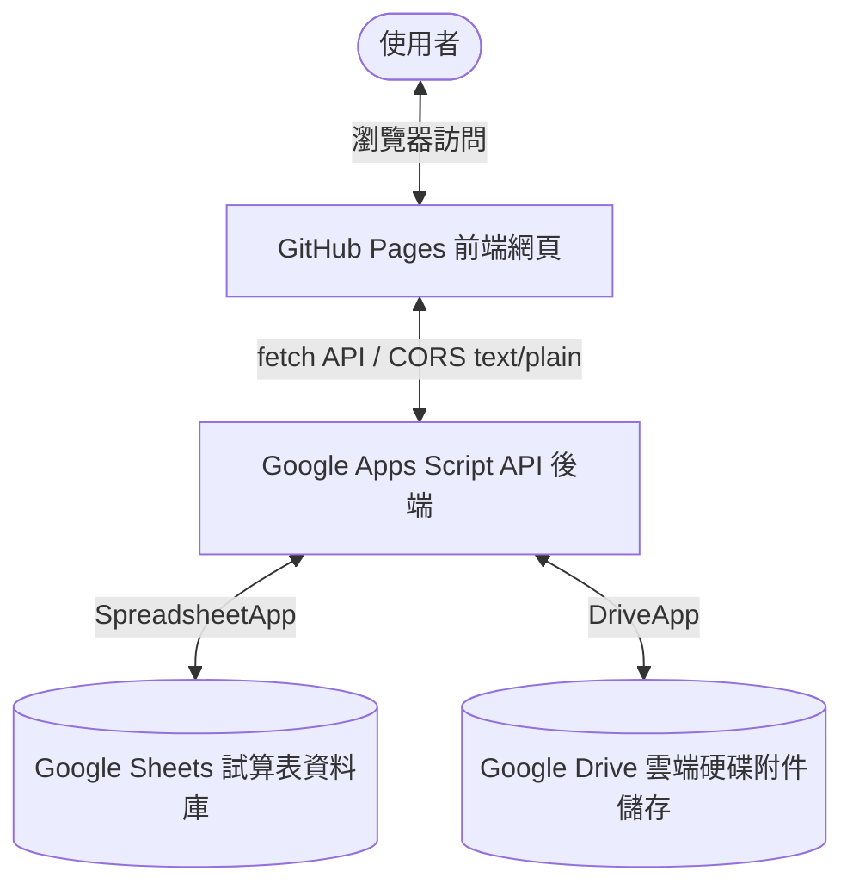

# Gem 提示詞管理系統 (前後端分離版) - 專案規格說明書

本規格書詳細定義了「Gem 提示詞管理系統」改寫後的系統架構、前端設計、後端 API 規格、雲端試算表資料格式，以及過去運作中曾經遭遇的痛點、系統崩潰預防方案與排除指南。

---

## 1. 系統架構說明 (System Architecture)

本系統採用 **前後端分離 (Decoupled)** 架構，將網頁展示與資料存取完全獨立：



### 前端託管 (Frontend)
- **平台**：GitHub Pages 靜態網頁託管。
- **技術棧**：原生 HTML5 + Javascript (ES6) + Tailwind CSS v4 (CDN) + FontAwesome 6 (CDN)。
- **通訊方式**：標準 `fetch` API 異步請求。

### 後端服務 (Backend API)
- **平台**：Google Apps Script (GAS) 部署為網頁應用程式 (Web App)。
- **資料庫**：Google Sheets (試算表)。
- **檔案庫**：Google Drive (雲端硬碟)。

---

## 2. 前端設計細節與介面規格

前端採用現代化、精簡且直觀的響應式設計（卡片式與表格融合式配置）：

| 介面元件 | 設計與交互細節 |
| :--- | :--- |
| **頂部導覽列 (Header)** | 包含系統 Logo (金黃寶石圖示)、主標題與「新增 Gem」按鈕。在手機版上會自動縮放並保持置頂 (sticky)。 |
| **篩選與搜尋列** | 1. **關鍵字搜尋**：即時監聽輸入，對 Gem 名稱進行不分大小寫的字串模糊比對。<br>2. **類別篩選**：下拉選單會依據雲端目前的資料動態生成分類選項，並附帶專屬 Emoji。<br>3. **收藏切換**：快速開關，僅顯示已收藏（星標）的項目。 |
| **資料表格 (Table)** | 1. 欄位包含：編號、類別、名稱（內嵌附件圖示）、收藏狀態、操作按鈕。<br>2. 點選 Gem 名稱可彈出「規格查看」視窗。<br>3. 支援分頁控制（可切換每頁 10、20、50 筆或全部顯示）。 |
| **規格查看彈窗 (View Modal)** | **【階段一升級】** 彈窗除了原本的「需求規格提示詞」外，新增展示：<br>1. **說明與用途**：獨立卡片展示文字描述。<br>2. **元資料徽章**：以顏色徽章展示「適用預設工具」與「來源」。<br>3. **附件下載區**：展示包含檔案圖標的下載按鈕，點選直接開啟/下載雲端檔案。<br>4. **外部連結**：若有 Gem 連結，底部顯示「開啟官方 Gem 連結」之快捷跳轉按鈕。 |
| **金鑰驗證彈窗 (Auth Modal)** | **【階段一新增】** 系統安全門戶。<br>1. 若瀏覽器 `localStorage` 未存有有效金鑰，或後端 API 判定金鑰失效（回傳 `auth_failed`），則會以高斯模糊 backdrop 鎖定網頁，要求輸入訪問金鑰。<br>2. 金鑰驗證通過後儲存於本地，後續操作與請求自動帶入該金鑰進行驗證。 |
| **操作按鈕群** | 1. **連結**：若資料包含 Gem 共享連結，顯示藍色按鈕並可點擊跳轉，無連結時按鈕呈灰色禁用狀態。<br>2. **複製**：綠色一鍵複製提示詞。<br>3. **編輯**：開啟編輯表單模組。 |
| **狀態通知 (Toast/Spinner)** | 1. 同步資料時顯示旋轉載入動畫 (Spinner)。<br>2. 任何動作成功（例如：複製成功、儲存成功）或失敗，皆由右下角滑入動態 Toast 提示，3秒後自動消失。 |

---

## 3. 後端試算表資料庫規格 (Google Sheets Database)

系統主要依賴兩個工作表 (Sheets)：`GemList`（主資料庫）與 `Settings`（分類設定項目）。

### 3.1 `GemList` 工作表欄位格式與驗證限制

| 欄位名稱 (A-K) | 資料格式 | 必填 | 說明、範例與限制 |
| :--- | :--- | :---: | :--- |
| **編號** | 字串 (String) | **是** | 格式為 `GEM-XXX` (如 `GEM-001`)。由後端於新增時自動生成，禁止使用者重複或手動編輯。 |
| **Gem類別** | 字串 (String) | **是** | 例如：`程式開發`、`圖片生成`、`日常工作`。若為空，後端會自動填入 `未分類`。 |
| **Gem名稱** | 字串 (String) | **是** | 系統顯示之標題。限制 1-100 字元。 |
| **說明（使用者）**| 字串 (String) | 否 | 簡述此提示詞的用途、目標對象或使用情境。 |
| **使用說明（需求規格）**| 長字串 (Text) | **是** | 存放具體的 System Prompt 或提示詞代碼。支援多行換行。 |
| **預設工具** | 字串 (String) | 否 | 例如：`Google Workspace`、`Web Search`。多個工具建議用逗號 `,` 分隔。 |
| **相關資訊** | JSON 字串 (JSON) | 否 | 存放附件的資訊。格式為：`[{"name":"檔名","url":"硬碟網址","id":"Drive檔案ID"}]`。<br>⚠️ **歷史相容**：若為舊格式的純網址字串，系統會自動轉換為歷史附件。 |
| **來源** | 字串 (String) | 否 | 例如：`自創`、`官方推薦`、`GitHub 收集`。 |
| **最後更新時間** | 時間 (DateTime) | **是** | 由後端寫入。寫入時為 Date 物件，API 輸出時格式化為 `YYYY-MM-DD HH:mm:ss`。 |
| **Gem連結** | 網址 (URL) | 否 | 必須以 `http://` 或 `https://` 開頭，例如：`https://gemini.google.com/gems/share/...`。 |
| **收藏** | 布林字串 | **是** | 必須填入大寫的 **`TRUE`** 或 **`FALSE`**（對應 Sheets 的布林值）。 |

---

### 3.2 `Settings` 工作表欄位格式

本工作表用於定義前端下拉選單的「預設分類項目」。

*   **工作表名稱**：必須完全命名為 **`Settings`**。
*   **結構定義**：
    *   第一行 (A1) 為標題欄（如：`分類清單`）。
    *   第二行以下 (A2, A3...) 存放具體的分類名稱（例如：`程式開發`、`翻譯寫作`、`圖片生成`）。
    *   後端會自動讀取 A 欄中所有非空白的儲存格作為分類選單。

---

## 4. 歷史版本升級痛點與踩坑紀錄 (Debugging History)

在過去的版本迭代與維護中，曾多次出現以下重複性技術問題，本次改寫已針對這些痛點進行了程式碼防禦：

### 痛點一：試算表空儲存格 (Null / Undefined) 導致系統崩潰
*   **原因**：當試算表中有某些欄位未填寫（如：某些舊資料沒有「相關資訊」或「預設工具」），Apps Script 讀取出的值為 `null` 或 `undefined`。此時若對其呼叫 `.toString()` 或 `.trim()`，會直接拋出 null pointer 錯誤，導致整個網頁 API 回傳 500 錯誤。
*   **本版防禦方案**：後端程式碼在處理欄位值時，統一加入預防性檢查：
    ```javascript
    if (cellValue === undefined || cellValue === null) { cellValue = ''; }
    ```

### 痛點二：舊版資料庫附件格式（逗號分隔）與新版 JSON 格式衝突
*   **原因**：舊版系統將多個附件網址以逗號 `,` 分隔存放在「相關資訊」欄位；新版系統為了能刪除實體檔案，將資料改為包含 `fileId` 的 JSON 陣列字串。直接解析會導致 `JSON.parse` 報錯。
*   **本版防禦方案**：前端與後端在解析「相關資訊」欄位時，均先判斷是否以 `[` 開頭。若否，則自動視為「歷史網址」，並將其分割後包裝為相容的 JSON 陣列：
    ```javascript
    if (rawStr.indexOf('[') === 0) {
      filesList = JSON.parse(rawStr);
    } else {
      // 舊格式相容解析
    }
    ```

### 痛點三：排序導致的實體列索引偏移 (Row Index Mismatch)
*   **原因**：前端顯示的 Gem 清單是經過「最後更新時間由新到舊」排序的，與 Google Sheets 中的實體物理行數 (Row Index) 不一致。若直接以表格的 index 去修改試算表，會改錯行。
*   **本版防禦方案**：後端在讀取所有資料時，會預先在物件中綁定該資料在 Google Sheets 的實體物理行數（`item['rowIndex'] = i + 1`）。當前端發送「編輯」或「刪除」請求時，**一律以物理 `rowIndex` 為依據**進行操作。

### 痛點四：欄位不存在導致溢位錯誤 (Index Out of Bounds)
*   **原因**：早期資料表只有 10 欄，後來新增了第 11 欄「收藏」。若直接讀取不存在的 index 10，會造成後端運作崩潰。
*   **本版防禦方案**：後端程式碼在執行儲存前，會動態比對 Header，若找不到「收藏」欄位，會自動在第 11 欄補上欄位名稱，並動態防禦：
    ```javascript
    var favIdx = headers.indexOf("收藏");
    if (favIdx === -1) {
      sheet.getRange(1, 11).setValue("收藏");
      favIdx = 10;
    }
    ```

---

## 5. 系統崩潰預防與解決方案 (Fail-safe Guidelines)

為了確保前後端分離版本長期穩定運作，必須注意以下可能發生的問題點及其解決方案：

### 5.1 跨網域預檢請求錯誤 (CORS Preflight Error)
*   **問題點**：GitHub Pages 與 Google Apps Script 位於不同網域。如果前端使用 `fetch` 傳送 `POST` 請求且設定 `Content-Type: application/json`，瀏覽器會自動先發送一個 `OPTIONS` 預檢請求。由於 Google Apps Script **不支援 OPTIONS 請求**，這會直接導致 CORS 失敗，網頁無法寫入資料。
*   **預防與解決方案**：
    > [!IMPORTANT]
    > 前端發送 `POST` 請求時，必須將 `Content-Type` 設為 **`text/plain`**。這會使請求被判定為「簡單請求 (Simple Request)」，從而**繞過 OPTIONS 預檢**。後端 `doPost(e)` 再透過 `e.postData.contents` 以字串方式接收，並手動進行 `JSON.parse()`。

### 5.2 GAS 部署版本未更新 (Deploy Version Caching)
*   **問題點**：每次修改後端的 `code.gs` 程式碼後，如果只是按下存檔，前端的 API 呼叫**不會發生任何改變**。這是因為 GAS Web App 依然執行舊版本的部署。
*   **預防與解決方案**：
    > [!WARNING]
    > 每次修改 `code.gs` 後，必須在 GAS 介面點選 **「部署」 > 「管理部署」**，編輯目前的部署，將 **「版本」選取為「新版本」** 並儲存。只有產生新的部署，修改的代碼才會正式生效。

### 5.3 雲端硬碟檔案權限不足 (Drive Permission Denied)
*   **問題點**：當使用者透過網頁上傳附件時，檔案會被建立在您的 Google Drive 中。如果該檔案沒有開放權限，其他使用者點選網頁上的附件連結時會出現「需要權限」的錯誤頁面。
*   **預防與解決方案**：
    後端在 `uploadFileToDriveEx()` 函式建立檔案後，必須立刻透過代碼設定該檔案為「知道連結的人即可檢視」：
    ```javascript
    file.setSharing(DriveApp.Access.ANYONE_WITH_LINK, DriveApp.Permission.VIEW);
    ```

### 5.4 Google API 配額超限 (Google Quota Limit Exceeded)
*   **問題點**：Google Apps Script 有每日配額限制。如果系統被大量頻繁存取，可能會觸發 `Exceeded maximum execution time` 或試算表讀寫限制。
*   **預防與解決方案**：
    - 前端設計了分頁功能（每頁預設 10 筆），避免一次渲染過多 DOM 元件。
    - 連線讀取時設有 loading 鎖定，避免使用者連續點擊按鈕發送重複的重複請求。

### 5.5 訪問金鑰失效與未授權阻擋 (Access Code Authentication)
*   **問題點**：當後端的存取金鑰密碼 `SECRET_ACCESS_CODE` 被修改、使用者輸入錯誤的金鑰，或本地金鑰過期時，若無妥善處理會導致 API 連續噴錯或網頁卡在 Loading 載入動畫。
*   **預防與解決方案**：
    - 後端統一在 `doGet` 與 `doPost` 最前端進行金鑰核對，不符時回傳 `{ status: 'error', code: 'auth_failed', message: '...' }`。
    - 前端在所有 `fetch` 的 Response 攔截器中判斷 `code === 'auth_failed'`。若成立，立刻清除本地的 `localStorage` 快取金鑰，並強制彈出 `#authModal` 金鑰驗證防護罩，實施網頁鎖定，避免網頁資料外洩或 UI 狀態卡死。

### 5.6 SWR 快取快照與資料一致性防禦 (SWR Caching & Data Consistency)
*   **問題點**：在 SWR 快取機制下，前端會優先讀取本地快取。若別台設備新增/刪除了資料，或是直接更新試算表，本地快取會呈現舊資料。此外，若寫入資料後快取沒有同步更新，會出現資料不一致的「時差」。
*   **預防與解決方案**：
    - **背景靜默同步比對**：每次網頁由快取渲染後，背景自動發送 silent 請求。只有在最新資料與快取不同時，才會重繪表格並更新快取，同時彈出「雲端資料已同步更新！」Toast 提示。若資料無變動，則不進行任何動作。
    - **資料異動強制污染快取 (Cache Invalidation)**：當前端執行新增、編輯或刪除操作成功後，強制執行阻擋式更新 (Blocking Fetch)，直接以雲端最新資料複寫本地快取，消除資料不同步風險。
    - **單一附件刪除即時覆蓋**：在編輯表單內刪除雲端檔案成功時，即時在內存與快取中同步過濾該檔案物件並執行覆寫，保證編輯過程中的一致性。

---

## 6. 後端 API clasp 自動部署工作流 (Backend Clasp Workflow)

為了方便本地端與雲端 Google Apps Script 進行同步，本專案採用 Google 官方的 `clasp` 工具進行自動化部署：

### 6.1 檔案說明
1. **package.json**：管理本地開發依賴，並內建快捷指令。
2. **.clasp.json**：設定 clasp 的配置檔。`rootDir` 指定為 `gas` 資料夾，`scriptId` 指向對應的 Google Apps Script 雲端專案 ID。
3. **gas/appsscript.json**：後端 Apps Script 的 Manifest 資訊清單（設定時區、執行引擎與 Web App 權限）。

### 6.2 快捷指令工作流
您可以在本機終端機中執行以下指令來管理後端：
- **`npm run login`**：登入您的 Google 帳號以獲取 API 授權。
- **`npm run pull`**：自雲端將最新程式碼同步拉取至本地的 `gas` 資料夾中。
- **`npm run push`**：將本地 gas/code.gs 程式碼推送到雲端專案中（覆蓋雲端程式碼）。
- **`npm run deploy`**：在雲端專案上建立一個新的版本部署，生成新的 API 版本。
- **`npm run status`**：檢查本地檔案與雲端專案的同步狀態。
